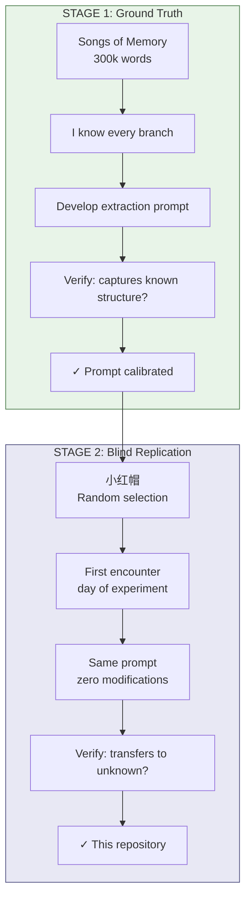
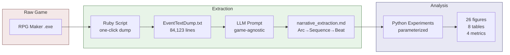
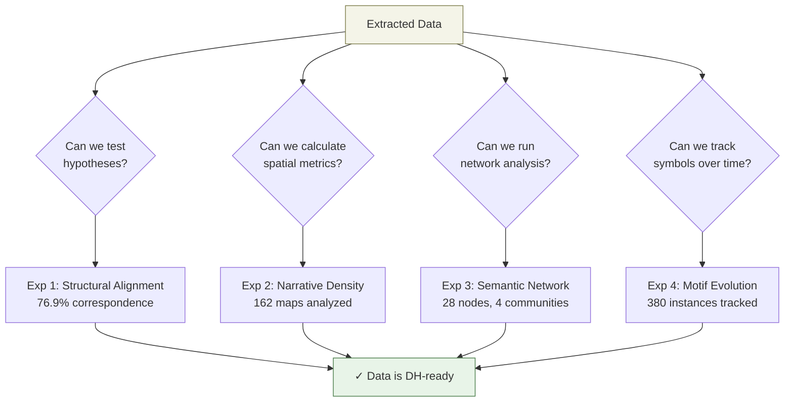
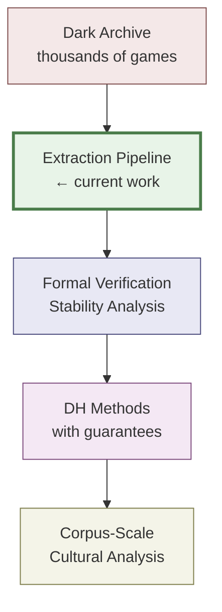
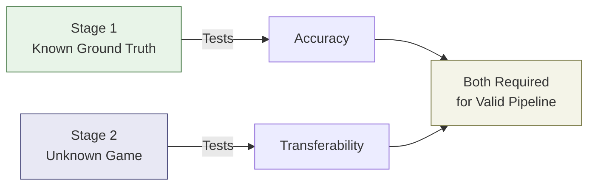

# Mermaid Flowcharts for Presentation

## Flowchart 1: Two-Stage Validation Design

## Flowchart 2: Extraction Pipeline

## Flowchart 3: What the Experiments Test

## Flowchart 4: The Bigger Pipeline

## Flowchart 5: Validation Logic (Simple)

---

## Usage Notes

Copy each mermaid code block into:
- [Mermaid Live Editor](https://mermaid.live/) to export as PNG/SVG
- Or use mermaid-cli: `mmdc -i flowchart.mmd -o flowchart.png`

Recommended exports:
- **Flowchart 1** (Two-Stage): Use for explaining validation design
- **Flowchart 2** (Pipeline): Use for "how it works" slide
- **Flowchart 3** (Experiments): Use for experiment overview
- **Flowchart 4** (Bigger Picture): Use for closing/context slide
